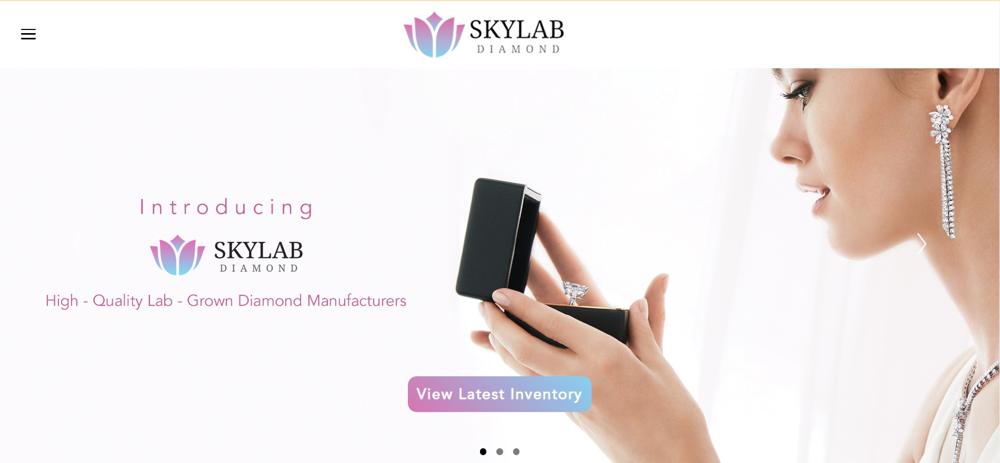
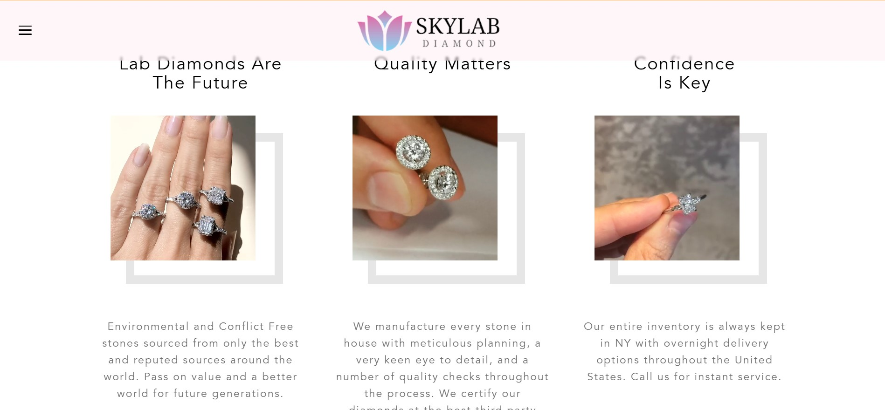
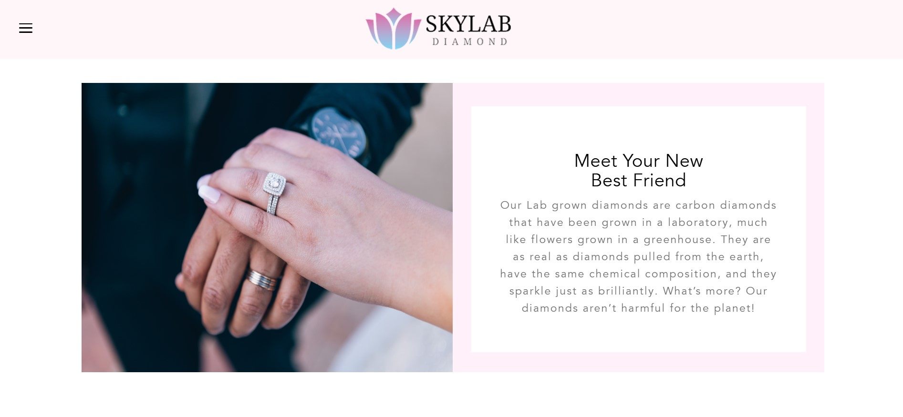
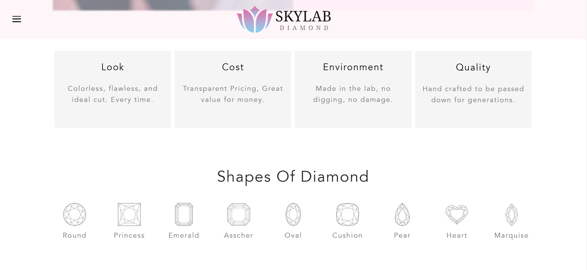
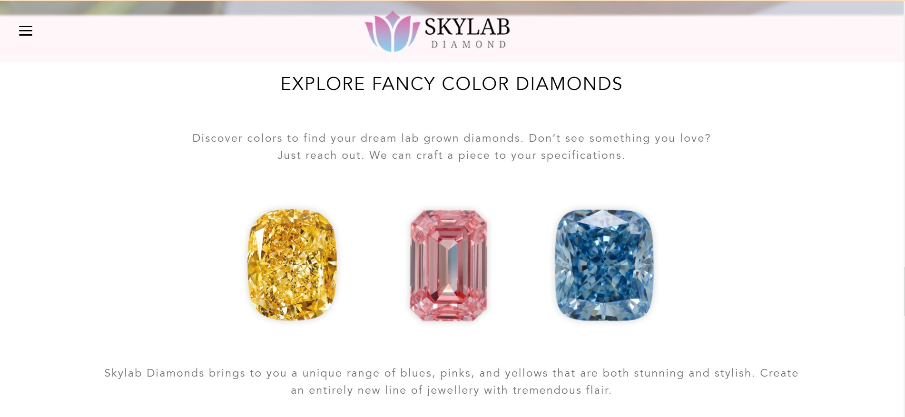
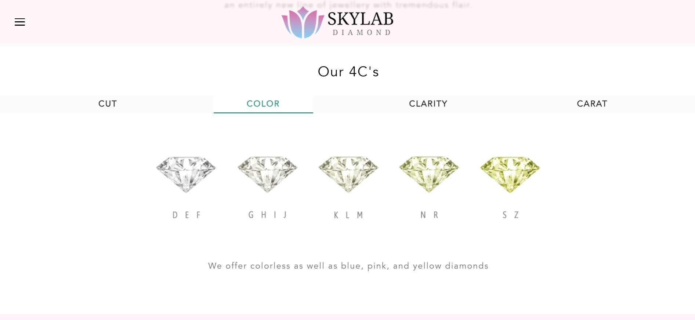
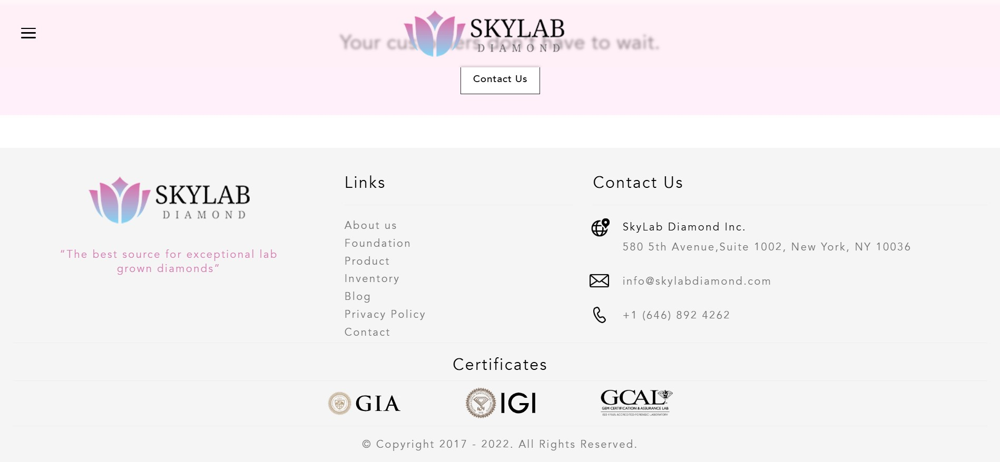
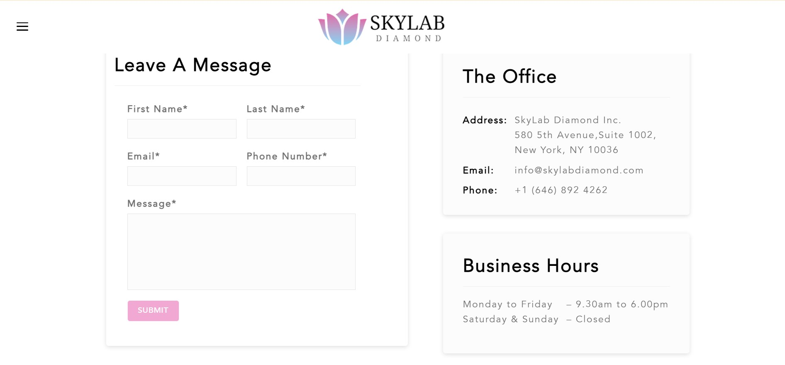

# SkyLabDiamonds

SkyLabDiamonds is a fully responsive diamond e-commerce website developed using HTML, CSS, JavaScript, and jQuery. This project showcases various diamond products with a modern and user-friendly design.

## Live Demo
[SkyLabDiamonds Live Project](https://raw.githack.com/Jenilpaladiya/SkyLabDiamonds/refs/heads/main/Home.html)

## Features
- Fully responsive design
- Interactive UI with jQuery animations
- Optimized for performance and usability
- Well-structured HTML, CSS, and JavaScript code

## Technologies Used
- HTML5
- CSS3
- JavaScript (ES6)
- jQuery

## Demo Images
Here are some preview images of the project:

# SkyLabDiamonds

SkyLabDiamonds is a fully responsive diamond e-commerce website developed using HTML, CSS, JavaScript, and jQuery. This project showcases various diamond products with a modern and user-friendly design.

## Live Demo
[SkyLabDiamonds Live Project](https://raw.githack.com/Jenilpaladiya/SkyLabDiamonds/refs/heads/main/Home.html)

## Features
- Fully responsive design
- Interactive UI with jQuery animations
- Optimized for performance and usability
- Image gallery showcasing diamond products
- Well-structured HTML, CSS, and JavaScript code

## Technologies Used
- HTML5
- CSS3
- JavaScript (ES6)
- jQuery

## Demo Images
Here are some preview images of the project:

  
&nbsp;  
  
&nbsp;  
  
&nbsp;  
  
&nbsp;  
  
&nbsp;  
  
&nbsp;  
  
&nbsp;  
  
&nbsp;  
  

## How to Run the Project
1. Clone this repository:
   ```sh
   git clone https://github.com/Jenilpaladiya/SkyLabDiamonds.git
   ```
2. Open the `index.html` file in your browser.

## Author
Developed by [Jenil Paladiya](https://github.com/Jenilpaladiya).

## License
This project is licensed under the MIT License.


## How to Run the Project
1. Clone this repository:
   ```sh
   git clone https://github.com/Jenilpaladiya/SkyLabDiamonds.git
   ```
2. Open the `index.html` file in your browser.

## Author
Developed by [Jenil Paladiya](https://github.com/Jenilpaladiya).

## License
This project is licensed under the MIT License.
